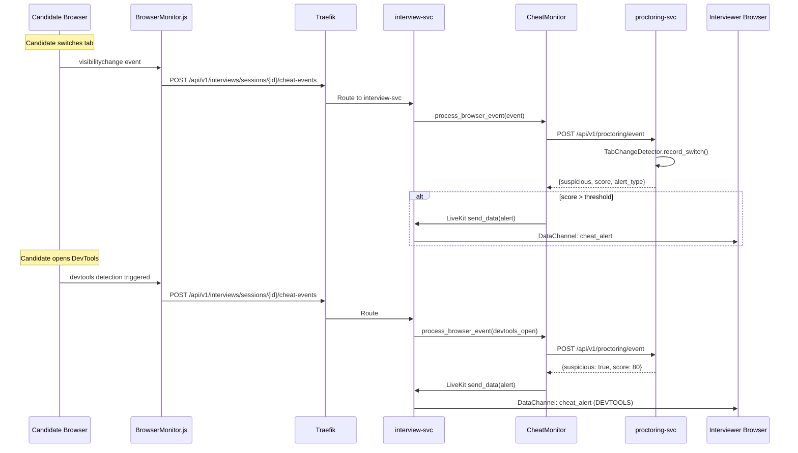
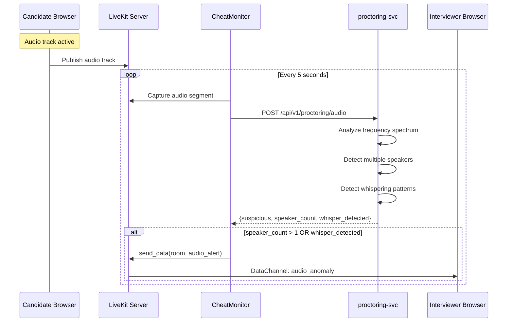

# Design Document: Interview Cheat Detection

## Overview

The Interview Cheat Detection feature integrates real-time anti-cheating capabilities into the existing interview session system. During live interviews conducted via the `interview-svc` with LiveKit video, the system continuously monitors candidate behavior through multiple detection channels: video frame analysis (face count, gaze tracking), browser event monitoring (tab switches, copy-paste, DevTools), audio anomaly detection (secondary speakers, whispering), and screen-sharing validation.

The architecture extends the existing `proctoring-svc` (which already handles frame ingestion and YOLO-based detection for exam sessions) to work seamlessly with interview sessions. A new `CheatMonitor` component within the `interview-svc` orchestrates detection by forwarding video frames and browser events to the `proctoring-svc`, aggregating risk scores via the existing `DecisionMaker`, and delivering real-time alerts to interviewers through LiveKit data channels.

The system follows a "no auto-fail" philosophy (consistent with the existing `DecisionMaker` design): suspicious behavior is scored, smoothed over time, and surfaced as alerts to interviewers who make the final judgment. This preserves fairness while giving interviewers actionable intelligence about candidate integrity.

## Architecture

```mermaid
graph TD
    subgraph Frontend - Candidate
        CW[Candidate WebApp]
        BM[BrowserMonitor.js<br/>Tab/Copy/DevTools]
        VC[Video Capture<br/>MediaStream]
    end

    subgraph Frontend - Interviewer
        IW[Interviewer WebApp]
        AP[AlertPanel Component]
        TL[CheatTimeline Component]
    end

    subgraph API Gateway
        TF[Traefik]
    end

    subgraph interview-svc
        IS[Session Service]
        CM[CheatMonitor<br/>Orchestrator]
        LA[LiveKit Adapter<br/>Data Channels]
    end

    subgraph proctoring-svc
        FR[Frame Analyzer<br/>YOLO + Gaze]
        EV[Event Processor<br/>Tab/Copy/Paste]
        AA[Audio Analyzer<br/>Speaker Detection]
        YP[YOLO Pool<br/>Batch Inference]
    end

    subgraph Risk Engine
        TS[Temporal Smoother]
        CE[Certainty Engine]
        DM[DecisionMaker]
    end

    subgraph Infrastructure
        RD[(Redis<br/>Score Cache)]
        PG[(PostgreSQL<br/>Alert Log)]
        LK[LiveKit Server<br/>SFU + Data]
    end

    CW --> BM
    CW --> VC
    BM -->|events| TF
    VC -->|frames| TF
    TF --> IS
    IS --> CM
    CM -->|POST /frame| FR
    CM -->|POST /event| EV
    CM -->|POST /audio| AA
    FR --> YP
    FR --> TS
    EV --> TS
    AA --> TS
    TS --> CE
    CE --> DM
    DM -->|decision| CM
    CM --> LA
    LA -->|data channel alert| LK
    LK -->|alert broadcast| IW
    IW --> AP
    IW --> TL
    CM --> RD
    CM --> PG


## Sequence Diagrams

### Real-Time Frame Analysis Flow

```mermaid
sequenceDiagram
    participant C as Candidate Browser
    participant LK as LiveKit Server
    participant IS as interview-svc
    participant CM as CheatMonitor
    participant PS as proctoring-svc
    participant RE as Risk Engine
    participant I as Interviewer Browser

    Note over C: Interview session active
    C->>LK: Publish video track
    LK->>IS: Webhook: track_published
    IS->>CM: start_monitoring(session_id, participant_id)
    
    loop Every 2 seconds
        CM->>LK: Capture frame from track
        CM->>PS: POST /api/v1/proctoring/frame
        PS->>PS: YOLO detect (faces, phones, books)
        PS->>PS: Gaze estimation
        PS->>RE: Aggregate signals
        RE->>RE: Temporal smoothing
        RE->>RE: Certainty calculation
        RE-->>PS: {score, verdict, signals}
        PS-->>CM: FrameResponse
        
        alt verdict == HIGH or CRITICAL
            CM->>LK: send_data(room, alert_payload)
            LK->>I: DataChannel: cheat_alert
            CM->>CM: Store alert in PostgreSQL
        end
    end
```

### Browser Event Detection Flow



### Audio Anomaly Detection Flow



## Components and Interfaces

### Component 1: CheatMonitor (interview-svc)

**Purpose**: Orchestrates cheat detection for interview sessions. Manages the lifecycle of monitoring per session, coordinates with proctoring-svc, aggregates results, and dispatches alerts via LiveKit data channels.

**Interface**:
```python
class CheatMonitor:
    """Orchestrates real-time cheat detection for interview sessions."""

    async def start_monitoring(
        self,
        session_id: str,
        room_name: str,
        candidate_identity: str,
    ) -> None: ...

    async def stop_monitoring(
        self,
        session_id: str,
    ) -> None: ...

    async def process_frame(
        self,
        session_id: str,
        frame_data: str,
        timestamp: str,
    ) -> CheatDetectionResult: ...

    async def process_browser_event(
        self,
        session_id: str,
        event_type: str,
        details: dict,
        timestamp: str,
    ) -> CheatDetectionResult: ...

    async def process_audio_segment(
        self,
        session_id: str,
        audio_data: list[float],
        sample_rate: int,
        timestamp: str,
    ) -> CheatDetectionResult: ...

    async def get_session_risk_summary(
        self,
        session_id: str,
    ) -> RiskSummary: ...

    async def get_alert_history(
        self,
        session_id: str,
        limit: int = 50,
    ) -> list[CheatAlert]: ...
```

**Responsibilities**:
- Start/stop monitoring lifecycle tied to interview session state
- Forward frames and events to proctoring-svc via HTTP
- Cache running risk scores in Redis
- Persist alerts to PostgreSQL
- Broadcast alerts to interviewers via LiveKit data channels
- Rate-limit frame processing (1 frame per 2 seconds)
- Aggregate multi-signal scores into a unified risk assessment

### Component 2: BrowserMonitor (Frontend JS)

**Purpose**: Client-side detection of browser-level cheating behaviors that cannot be detected server-side.

**Interface**:
```python
# TypeScript interface (represented in Python-style for consistency)
class BrowserMonitor:
    """Client-side browser event detection."""

    def start(self, session_id: str, api_base_url: str) -> None: ...
    def stop(self) -> None: ...
    def on_tab_switch(self, callback: Callable) -> None: ...
    def on_copy_paste(self, callback: Callable) -> None: ...
    def on_devtools_open(self, callback: Callable) -> None: ...
    def on_fullscreen_exit(self, callback: Callable) -> None: ...
    def get_event_count(self) -> dict: ...
```

**Responsibilities**:
- Detect `visibilitychange` events (tab switches / window focus loss)
- Detect copy/paste via clipboard API interception
- Detect DevTools opening (debugger timing, window size heuristics)
- Detect fullscreen exit during interview
- Batch and send events to interview-svc endpoint
- Debounce rapid-fire events to avoid flooding

### Component 3: AlertDispatcher (interview-svc)

**Purpose**: Formats and delivers cheat detection alerts to interviewers via LiveKit data channels with appropriate severity levels.

**Interface**:
```python
class AlertDispatcher:
    """Delivers cheat alerts to interviewers via LiveKit data channels."""

    async def dispatch_alert(
        self,
        session_id: str,
        room_name: str,
        alert: CheatAlert,
    ) -> None: ...

    async def dispatch_risk_update(
        self,
        session_id: str,
        room_name: str,
        risk_summary: RiskSummary,
    ) -> None: ...

    async def dispatch_monitoring_status(
        self,
        session_id: str,
        room_name: str,
        status: str,
    ) -> None: ...
```

**Responsibilities**:
- Format alert payloads as JSON for LiveKit data channel
- Include alert type, severity, timestamp, and evidence summary
- Send periodic risk score updates (every 10 seconds)
- Notify interviewers when monitoring starts/stops

### Component 4: InterviewCheatEventRouter (interview-svc API)

**Purpose**: API endpoints that receive browser events from the candidate's frontend and route them to the CheatMonitor.

**Interface**:
```python
# FastAPI router endpoints
router = APIRouter(prefix="/api/v1/interviews/sessions/{session_id}")

@router.post("/cheat-events")
async def report_cheat_event(
    session_id: str,
    body: CheatEventRequest,
) -> CheatEventResponse: ...

@router.get("/cheat-summary")
async def get_cheat_summary(
    session_id: str,
) -> RiskSummaryResponse: ...

@router.get("/cheat-alerts")
async def get_cheat_alerts(
    session_id: str,
    limit: int = 50,
) -> list[CheatAlertResponse]: ...

@router.post("/cheat-monitoring/start")
async def start_cheat_monitoring(
    session_id: str,
) -> MonitoringStatusResponse: ...

@router.post("/cheat-monitoring/stop")
async def stop_cheat_monitoring(
    session_id: str,
) -> MonitoringStatusResponse: ...
```

**Responsibilities**:
- Validate incoming browser events from candidate frontend
- Authenticate requests (JWT validation)
- Route events to CheatMonitor for processing
- Provide REST endpoints for interviewers to query alert history and risk summaries
- Start/stop monitoring endpoints (interviewer-only)

### Component 5: AudioAnomalyDetector (proctoring-svc)

**Purpose**: Extends the existing `AudioAnalyzer` in proctoring-svc to detect multiple speakers and whispering during interview sessions.

**Interface**:
```python
class AudioAnomalyDetector:
    """Detects audio anomalies: multiple speakers, whispering, coaching."""

    def analyze_segment(
        self,
        audio_data: np.ndarray,
        sample_rate: int = 16000,
    ) -> AudioAnalysisResult: ...

    def detect_multiple_speakers(
        self,
        audio_data: np.ndarray,
        sample_rate: int,
    ) -> SpeakerDetectionResult: ...

    def detect_whispering(
        self,
        audio_data: np.ndarray,
        sample_rate: int,
    ) -> WhisperDetectionResult: ...

    def get_voice_activity(
        self,
        audio_data: np.ndarray,
        sample_rate: int,
    ) -> VoiceActivityResult: ...
```

**Responsibilities**:
- Analyze audio segments for multiple concurrent speakers
- Detect whispering patterns (low amplitude, specific frequency profile)
- Voice activity detection to distinguish speech from silence
- Return confidence scores for each detection type

## Data Models

### Model: CheatAlert

```python
class CheatAlert(Base):
    __tablename__ = "cheat_alerts"

    id = Column(String(36), primary_key=True, default=lambda: str(uuid4()))
    session_id = Column(String(36), ForeignKey("interview_sessions.id"), nullable=False, index=True)
    alert_type = Column(String(50), nullable=False)  # TAB_SWITCH, MULTIPLE_FACES, GAZE_AWAY, etc.
    severity = Column(String(20), nullable=False)  # MILD, HIGH, CRITICAL
    score = Column(Float, nullable=False)
    confidence = Column(Float, nullable=False)
    details = Column(JSON, nullable=True)  # Signal-specific metadata
    evidence_snapshot = Column(Text, nullable=True)  # Base64 frame thumbnail at alert time
    created_at = Column(DateTime, default=func.now(), nullable=False)
    acknowledged = Column(Boolean, default=False)
    acknowledged_by = Column(Integer, nullable=True)
    acknowledged_at = Column(DateTime, nullable=True)
```

**Validation Rules**:
- `alert_type` must be one of the defined alert types (see enum below)
- `severity` must be one of: MILD, HIGH, CRITICAL
- `score` must be in range [0, 100]
- `confidence` must be in range [0.0, 1.0]
- `session_id` must reference an existing active interview session

### Model: CheatMonitoringState

```python
class CheatMonitoringState(Base):
    __tablename__ = "cheat_monitoring_states"

    id = Column(String(36), primary_key=True, default=lambda: str(uuid4()))
    session_id = Column(String(36), ForeignKey("interview_sessions.id"), unique=True, nullable=False)
    status = Column(String(20), default="inactive")  # inactive, active, paused
    started_at = Column(DateTime, nullable=True)
    stopped_at = Column(DateTime, nullable=True)
    total_frames_processed = Column(Integer, default=0)
    total_events_processed = Column(Integer, default=0)
    total_alerts_generated = Column(Integer, default=0)
    current_risk_score = Column(Float, default=0.0)
    current_verdict = Column(String(20), default="SAFE")
    config = Column(JSON, nullable=True)  # Per-session detection config overrides
```

**Validation Rules**:
- `status` transitions: inactive → active → paused → active → inactive (stop)
- `session_id` must be unique (one monitoring state per session)
- `current_risk_score` must be in range [0, 100]
- `current_verdict` must be one of: SAFE, MILD, HIGH, CRITICAL

### Model: CheatDetectionResult (Pydantic)

```python
class CheatDetectionResult(BaseModel):
    """Result from a single detection cycle."""
    
    suspicious: bool
    score: float  # 0-100
    confidence: float  # 0.0-1.0
    verdict: str  # SAFE, MILD, HIGH, CRITICAL
    alert_type: str  # Primary alert type
    signals: dict[str, float]  # Signal name → score
    should_alert: bool  # Whether to send alert to interviewer
    details: dict  # Signal-specific details
```

### Model: RiskSummary (Pydantic)

```python
class RiskSummary(BaseModel):
    """Aggregated risk summary for a session."""
    
    session_id: str
    current_score: float
    current_verdict: str
    total_alerts: int
    alerts_by_severity: dict[str, int]  # {MILD: 3, HIGH: 1, CRITICAL: 0}
    alerts_by_type: dict[str, int]  # {TAB_SWITCH: 2, GAZE_AWAY: 1, ...}
    monitoring_duration_seconds: float
    frames_processed: int
    events_processed: int
    top_signals: list[dict]  # Top 3 active signals with scores
```

### Enum: AlertType

```python
class AlertType(str, Enum):
    # Video-based
    MULTIPLE_FACES = "MULTIPLE_FACES"
    NO_FACE = "NO_FACE"
    GAZE_AWAY = "GAZE_AWAY"
    PHONE_DETECTED = "PHONE_DETECTED"
    BOOK_DETECTED = "BOOK_DETECTED"
    
    # Browser-based
    TAB_SWITCH = "TAB_SWITCH"
    COPY_DETECTED = "COPY_DETECTED"
    PASTE_DETECTED = "PASTE_DETECTED"
    DEVTOOLS_OPEN = "DEVTOOLS_OPEN"
    FULLSCREEN_EXIT = "FULLSCREEN_EXIT"
    
    # Audio-based
    MULTIPLE_SPEAKERS = "MULTIPLE_SPEAKERS"
    WHISPER_DETECTED = "WHISPER_DETECTED"
    
    # Composite
    SUSPICIOUS_PATTERN = "SUSPICIOUS_PATTERN"
```


## Algorithmic Pseudocode

### Main Monitoring Loop Algorithm

```python
async def monitoring_loop(session_id: str, room_name: str, candidate_identity: str):
    """
    Main monitoring loop that captures frames and analyzes them periodically.
    
    Preconditions:
        - session_id refers to an active interview session
        - room_name is a valid LiveKit room with the candidate connected
        - candidate_identity is the LiveKit identity of the candidate
        - Monitoring state is "active"
    
    Postconditions:
        - All frames processed are logged in monitoring state
        - Alerts generated for HIGH/CRITICAL verdicts
        - Monitoring stops when session ends or stop_monitoring is called
        - Redis score cache is updated after each frame
    
    Loop Invariants:
        - monitoring_state.status == "active" throughout loop execution
        - frame_count == monitoring_state.total_frames_processed at each iteration
        - All generated alerts are persisted before next iteration
    """
    FRAME_INTERVAL = 2.0  # seconds between frame captures
    AUDIO_INTERVAL = 5.0  # seconds between audio analysis
    RISK_BROADCAST_INTERVAL = 10.0  # seconds between risk updates to interviewer
    
    last_frame_time = 0.0
    last_audio_time = 0.0
    last_broadcast_time = 0.0
    frame_count = 0
    
    while await is_monitoring_active(session_id):
        now = time.time()
        
        # Frame analysis at 0.5 FPS
        if now - last_frame_time >= FRAME_INTERVAL:
            frame_data = await capture_frame_from_livekit(room_name, candidate_identity)
            if frame_data is not None:
                result = await analyze_frame_via_proctoring_svc(session_id, frame_data, now)
                frame_count += 1
                await update_monitoring_state(session_id, frame_count=frame_count)
                await update_risk_cache(session_id, result)
                
                if result.should_alert:
                    alert = await create_and_persist_alert(session_id, result)
                    await dispatch_alert_to_interviewers(session_id, room_name, alert)
            
            last_frame_time = now
        
        # Audio analysis at 0.2 FPS
        if now - last_audio_time >= AUDIO_INTERVAL:
            audio_segment = await capture_audio_from_livekit(room_name, candidate_identity)
            if audio_segment is not None:
                audio_result = await analyze_audio_via_proctoring_svc(
                    session_id, audio_segment, now
                )
                if audio_result.suspicious:
                    alert = await create_and_persist_alert(session_id, audio_result)
                    await dispatch_alert_to_interviewers(session_id, room_name, alert)
            
            last_audio_time = now
        
        # Periodic risk broadcast to interviewers
        if now - last_broadcast_time >= RISK_BROADCAST_INTERVAL:
            risk_summary = await get_session_risk_summary(session_id)
            await dispatch_risk_update(session_id, room_name, risk_summary)
            last_broadcast_time = now
        
        await asyncio.sleep(0.5)  # Prevent busy-waiting
```

### Browser Event Processing Algorithm

```python
async def process_browser_event(
    session_id: str,
    event_type: str,
    details: dict,
    timestamp: str,
) -> CheatDetectionResult:
    """
    Process a browser-originated cheat event from the candidate.
    
    Preconditions:
        - session_id refers to an active session with monitoring enabled
        - event_type is a valid AlertType browser event
        - timestamp is ISO 8601 format
    
    Postconditions:
        - Event is forwarded to proctoring-svc for scoring
        - Running risk score is updated in Redis
        - If score exceeds threshold, alert is created and dispatched
        - Event count is incremented in monitoring state
        - Returns CheatDetectionResult with current assessment
    
    Loop Invariants: N/A (no loops)
    """
    # Step 1: Validate monitoring is active
    state = await get_monitoring_state(session_id)
    if state is None or state.status != "active":
        return CheatDetectionResult(suspicious=False, score=0, verdict="SAFE", ...)
    
    # Step 2: Forward to proctoring-svc for scoring
    proctoring_response = await http_client.post(
        f"{PROCTORING_SVC_URL}/api/v1/proctoring/event",
        json={
            "session_id": session_id,
            "session_kind": "interview",
            "event_type": event_type,
            "details": json.dumps(details),
            "content": details.get("content", ""),
            "timestamp": timestamp,
        }
    )
    
    event_result = proctoring_response.json()
    
    # Step 3: Apply interview-specific scoring adjustments
    adjusted_score = apply_interview_context_adjustment(
        base_score=event_result["score"],
        event_type=event_type,
        session_state=state,
    )
    
    # Step 4: Update running risk in Redis
    current_risk = await update_risk_cache(session_id, adjusted_score, event_type)
    
    # Step 5: Determine verdict using DecisionMaker thresholds
    verdict = determine_verdict(current_risk)
    should_alert = verdict in ("HIGH", "CRITICAL")
    
    # Step 6: Increment event counter
    await increment_event_count(session_id)
    
    result = CheatDetectionResult(
        suspicious=event_result["suspicious"],
        score=adjusted_score,
        confidence=0.9,  # Browser events have high confidence
        verdict=verdict,
        alert_type=event_type.upper(),
        signals={event_type: adjusted_score},
        should_alert=should_alert,
        details=details,
    )
    
    # Step 7: Create alert if threshold exceeded
    if should_alert:
        alert = await create_and_persist_alert(session_id, result)
        room_name = await get_room_name_for_session(session_id)
        await dispatch_alert_to_interviewers(session_id, room_name, alert)
    
    return result
```

### Risk Score Aggregation Algorithm

```python
async def aggregate_risk_score(
    session_id: str,
    new_signal: str,
    new_score: float,
) -> float:
    """
    Aggregate a new detection signal into the session's running risk score.
    Uses exponential moving average with multi-signal boost.
    
    Preconditions:
        - session_id has an active monitoring state
        - new_signal is a valid signal name
        - new_score is in range [0, 100]
    
    Postconditions:
        - Returns aggregated risk score in range [0, 100]
        - Redis cache updated with new signal history
        - Score reflects temporal smoothing (recent signals weighted higher)
        - Multi-signal correlation boost applied when 2+ signals active
    
    Loop Invariants:
        - For signal history iteration: all processed signals have valid scores in [0, 100]
        - Running EMA is always in [0, 100]
    """
    ALPHA = 0.3  # EMA smoothing factor
    SIGNAL_WINDOW = 30  # seconds to consider signals "active"
    MULTI_SIGNAL_BOOST = 0.1  # 10% boost per additional active signal
    
    # Step 1: Retrieve signal history from Redis
    signal_history = await redis.hgetall(f"cheat:signals:{session_id}")
    
    # Step 2: Update signal with new score (EMA)
    if new_signal in signal_history:
        prev_score = float(signal_history[new_signal]["score"])
        smoothed = ALPHA * new_score + (1 - ALPHA) * prev_score
    else:
        smoothed = new_score
    
    # Step 3: Store updated signal
    await redis.hset(f"cheat:signals:{session_id}", new_signal, json.dumps({
        "score": smoothed,
        "last_seen": time.time(),
    }))
    
    # Step 4: Collect active signals (seen within window)
    now = time.time()
    active_signals = {}
    for signal_name, signal_data in signal_history.items():
        data = json.loads(signal_data)
        if now - data["last_seen"] < SIGNAL_WINDOW and data["score"] > 10:
            active_signals[signal_name] = data["score"]
    
    # Include the new signal
    active_signals[new_signal] = smoothed
    
    # Step 5: Calculate aggregate score
    if not active_signals:
        return 0.0
    
    max_score = max(active_signals.values())
    avg_score = sum(active_signals.values()) / len(active_signals)
    
    # Weighted combination: 60% max, 40% average
    base_score = max_score * 0.6 + avg_score * 0.4
    
    # Multi-signal boost
    boost = 1 + (len(active_signals) - 1) * MULTI_SIGNAL_BOOST
    final_score = min(100.0, base_score * boost)
    
    # Step 6: Update session risk score in Redis
    await redis.set(f"cheat:risk:{session_id}", final_score)
    
    return final_score
```

### Alert Dispatch Algorithm

```python
async def dispatch_alert_to_interviewers(
    session_id: str,
    room_name: str,
    alert: CheatAlert,
) -> None:
    """
    Send a cheat alert to all connected interviewers via LiveKit data channel.
    
    Preconditions:
        - session_id refers to an active session
        - room_name is a valid LiveKit room
        - alert is a persisted CheatAlert record
    
    Postconditions:
        - All connected interviewers receive the alert via data channel
        - Alert payload includes type, severity, score, timestamp, and evidence
        - Delivery is best-effort (no retry on data channel failure)
        - Alert is marked as dispatched in the database
    
    Loop Invariants: N/A
    """
    payload = json.dumps({
        "type": "cheat_alert",
        "alert_id": alert.id,
        "alert_type": alert.alert_type,
        "severity": alert.severity,
        "score": alert.score,
        "confidence": alert.confidence,
        "details": alert.details,
        "timestamp": alert.created_at.isoformat(),
        "session_id": session_id,
    })
    
    await livekit_adapter.send_data(
        room_name=room_name,
        data=payload,
    )
```

## Key Functions with Formal Specifications

### Function 1: start_monitoring()

```python
async def start_monitoring(
    self,
    session_id: str,
    room_name: str,
    candidate_identity: str,
) -> None:
```

**Preconditions:**
- `session_id` refers to an existing interview session with status "active"
- `room_name` is a valid LiveKit room with at least one connected participant
- `candidate_identity` is the LiveKit identity of a connected interviewee
- No monitoring is currently active for this session (state is "inactive")
- Caller has interviewer role in the session

**Postconditions:**
- A `CheatMonitoringState` record is created with status "active"
- The monitoring loop background task is started
- Redis keys are initialized for signal tracking
- Interviewers receive a `monitoring_started` data channel message
- Frame capture begins at the configured interval

**Loop Invariants:** N/A

### Function 2: process_frame()

```python
async def process_frame(
    self,
    session_id: str,
    frame_data: str,
    timestamp: str,
) -> CheatDetectionResult:
```

**Preconditions:**
- `session_id` has active monitoring (state.status == "active")
- `frame_data` is a valid base64-encoded JPEG image
- `timestamp` is ISO 8601 format
- At least `FRAME_INTERVAL` seconds have elapsed since last frame

**Postconditions:**
- Frame is analyzed by proctoring-svc (YOLO + gaze)
- Returns `CheatDetectionResult` with score, verdict, and signals
- `monitoring_state.total_frames_processed` is incremented by 1
- If `verdict` is HIGH or CRITICAL, a `CheatAlert` is persisted
- Redis risk cache is updated with new signal scores
- No side effects on the LiveKit room state

**Loop Invariants:** N/A

### Function 3: aggregate_risk_score()

```python
async def aggregate_risk_score(
    self,
    session_id: str,
    new_signal: str,
    new_score: float,
) -> float:
```

**Preconditions:**
- `session_id` has an active monitoring state
- `new_signal` is a valid signal name (member of AlertType or internal signal)
- `new_score` is in range [0, 100]
- Redis is available for read/write

**Postconditions:**
- Returns aggregated risk score in range [0, 100]
- Signal history in Redis is updated with EMA-smoothed score
- Active signals older than `SIGNAL_WINDOW` seconds are excluded from aggregation
- Multi-signal boost is applied: `boost = 1 + (active_count - 1) * 0.1`
- Final score = `min(100, (max_score * 0.6 + avg_score * 0.4) * boost)`

**Loop Invariants:**
- For signal history iteration: all scores are in [0, 100]
- Active signal count is always >= 0

### Function 4: determine_verdict()

```python
def determine_verdict(risk_score: float) -> str:
```

**Preconditions:**
- `risk_score` is a float in range [0, 100]

**Postconditions:**
- Returns exactly one of: "SAFE", "MILD", "HIGH", "CRITICAL"
- Mapping is deterministic and monotonic:
  - [0, 30) → "SAFE"
  - [30, 50) → "MILD"
  - [50, 80) → "HIGH"
  - [80, 100] → "CRITICAL"
- Consistent with existing `DecisionMaker.THRESHOLDS`

**Loop Invariants:** N/A

### Function 5: detect_multiple_speakers()

```python
def detect_multiple_speakers(
    self,
    audio_data: np.ndarray,
    sample_rate: int,
) -> SpeakerDetectionResult:
```

**Preconditions:**
- `audio_data` is a 1D numpy array of float32 audio samples
- `sample_rate` is a positive integer (typically 16000 or 44100)
- `len(audio_data) >= sample_rate` (at least 1 second of audio)

**Postconditions:**
- Returns `SpeakerDetectionResult` with `speaker_count`, `confidence`, and `suspicious`
- `speaker_count` is >= 0
- `confidence` is in [0.0, 1.0]
- `suspicious` is True if and only if `speaker_count > 1` and `confidence > 0.6`
- Analysis uses spectral clustering on mel-frequency features
- No mutation of input `audio_data`

**Loop Invariants:** N/A

## Example Usage

```python
# Example 1: Starting cheat monitoring when interview begins
from app.services.cheat_monitor import CheatMonitor
from app.services.livekit_adapter import LiveKitAdapter

livekit = LiveKitAdapter()
monitor = CheatMonitor(livekit=livekit, redis=redis_client, db=db_session)

# Interviewer starts monitoring after candidate joins
await monitor.start_monitoring(
    session_id="a1b2c3d4-5678-90ab-cdef-1234567890ab",
    room_name="interview_a1b2c3d4",
    candidate_identity="101",  # candidate user_id
)


# Example 2: Processing a browser event from candidate frontend
result = await monitor.process_browser_event(
    session_id="a1b2c3d4-5678-90ab-cdef-1234567890ab",
    event_type="tab_switch",
    details={"away_duration_ms": 3500, "target_url": "hidden"},
    timestamp="2025-07-15T14:05:23Z",
)
# result.suspicious = True
# result.score = 45.0
# result.verdict = "MILD"
# result.should_alert = False (MILD doesn't trigger alert)


# Example 3: DevTools detection triggers HIGH alert
result = await monitor.process_browser_event(
    session_id="a1b2c3d4-5678-90ab-cdef-1234567890ab",
    event_type="devtools_open",
    details={"detection_method": "timing"},
    timestamp="2025-07-15T14:06:01Z",
)
# result.suspicious = True
# result.score = 80.0
# result.verdict = "HIGH"
# result.should_alert = True
# → Alert dispatched to interviewers via LiveKit data channel


# Example 4: Interviewer queries risk summary
summary = await monitor.get_session_risk_summary(
    session_id="a1b2c3d4-5678-90ab-cdef-1234567890ab",
)
# summary.current_score = 52.3
# summary.current_verdict = "HIGH"
# summary.total_alerts = 3
# summary.alerts_by_type = {"TAB_SWITCH": 2, "DEVTOOLS_OPEN": 1}
# summary.top_signals = [
#     {"signal": "devtools", "score": 80.0},
#     {"signal": "tab_switch", "score": 45.0},
# ]


# Example 5: Frontend BrowserMonitor integration (TypeScript)
# import { BrowserMonitor } from './cheat-detection/browser-monitor';
#
# const monitor = new BrowserMonitor();
# monitor.start(sessionId, '/api/v1/interviews');
#
# // Automatically detects and reports:
# // - Tab switches (visibilitychange)
# // - Copy/paste (clipboard events)
# // - DevTools (timing detection)
# // - Fullscreen exit


# Example 6: LiveKit data channel alert received by interviewer
# {
#     "type": "cheat_alert",
#     "alert_id": "f47ac10b-58cc-4372-a567-0e02b2c3d479",
#     "alert_type": "MULTIPLE_FACES",
#     "severity": "CRITICAL",
#     "score": 90.0,
#     "confidence": 0.95,
#     "details": {"face_count": 2, "phone_detected": false},
#     "timestamp": "2025-07-15T14:07:45Z",
#     "session_id": "a1b2c3d4-5678-90ab-cdef-1234567890ab"
# }
```


## Correctness Properties

*A property is a characteristic or behavior that should hold true across all valid executions of a system — essentially, a formal statement about what the system should do. Properties serve as the bridge between human-readable specifications and machine-verifiable correctness guarantees.*

### Property 1: Risk Score Boundedness

*For any* interview session with active monitoring, and *for any* sequence of frame analyses, browser events, and audio analyses processed, the aggregated risk score shall always be in the range [0, 100]. No combination of signals or temporal smoothing shall produce a score outside this range.

**Validates: Requirements 5.2, 11.3, 11.6**

### Property 2: Verdict Monotonicity with Score

*For any* two risk scores `s1` and `s2` where `s1 < s2`, the verdict for `s1` shall be less than or equal to the verdict for `s2` in severity ordering (SAFE < MILD < HIGH < CRITICAL). The verdict function is monotonically non-decreasing with respect to score.

**Validates: Requirements 6.1, 6.2**

### Property 3: Alert Generation Threshold Consistency

*For any* detection result with verdict "HIGH" or "CRITICAL", an alert shall be generated and persisted. *For any* detection result with verdict "SAFE" or "MILD", no alert shall be generated. The `should_alert` field is true if and only if `verdict ∈ {HIGH, CRITICAL}`.

**Validates: Requirements 6.3, 6.4**

### Property 4: Temporal Smoothing Convergence

*For any* signal with a constant input value `v` applied repeatedly, the EMA-smoothed output shall converge to `v`. Specifically, after `n` applications, the smoothed value `s_n` satisfies `|s_n - v| ≤ v * (1 - α)^n` where `α` is the smoothing factor.

**Validates: Requirements 5.1, 5.7**

### Property 5: Multi-Signal Boost Boundedness

*For any* set of active signals, the multi-signal boost factor shall be `1 + (count - 1) * 0.1`. The final aggregated score after boost shall never exceed 100. Specifically: `min(100, base_score * boost) <= 100` for all valid inputs.

**Validates: Requirements 5.3, 5.4**

### Property 6: Monitoring State Lifecycle

*For any* interview session, the monitoring state shall follow the lifecycle: inactive → active → (paused ↔ active) → inactive. The state "active" can only be reached from "inactive" or "paused". The state "inactive" (stopped) is terminal — once stopped, monitoring cannot be restarted for the same session without creating a new state.

**Validates: Requirements 1.7, 1.5**

### Property 7: Frame Rate Limiting

*For any* active monitoring session, the number of frames processed in any 2-second window shall be at most 1. The system shall not process frames faster than the configured `FRAME_INTERVAL` regardless of how frequently frames are available.

**Validates: Requirement 2.1**

### Property 8: Alert Dispatch Targeting

*For any* cheat alert dispatched via LiveKit data channel, the alert shall be sent to the room associated with the session. Only participants in that specific room receive the alert. No cross-session alert leakage shall occur.

**Validates: Requirement 7.5**

### Property 9: Signal Window Expiry

*For any* signal that has not been updated for more than `SIGNAL_WINDOW` seconds (30s), that signal shall be excluded from the risk aggregation calculation. The aggregated score shall only reflect signals observed within the active window.

**Validates: Requirement 5.5**

### Property 10: Browser Event Idempotency

*For any* browser event with identical `session_id`, `event_type`, and `timestamp`, processing it multiple times shall produce the same `CheatDetectionResult`. Duplicate events (same timestamp) shall not double-count in the risk score.

**Validates: Requirements 12.1, 12.2**

### Property 11: No Auto-Fail Guarantee

*For any* risk score, verdict, or alert combination, the system shall never automatically terminate an interview session or remove a candidate. The maximum automated action is "flag_for_review" with interviewer notification. Session termination requires explicit interviewer action.

**Validates: Requirements 9.1, 9.2, 9.3, 9.4**

### Property 12: Data Validation Completeness

*For any* CheatAlert record created by the system, the alert_type shall be a member of the AlertType enumeration, severity shall be one of MILD/HIGH/CRITICAL, score shall be in [0, 100], and confidence shall be in [0.0, 1.0]. *For any* CheatDetectionResult, the verdict shall be one of SAFE/MILD/HIGH/CRITICAL.

**Validates: Requirements 11.1, 11.2, 11.3, 11.4, 11.5**

### Property 13: Audio Input Immutability

*For any* audio data array passed to the AudioAnomalyDetector for analysis, the array contents shall be identical before and after the analysis call. The detector shall not mutate its input.

**Validates: Requirement 4.5**

### Property 14: Alert Payload Completeness

*For any* alert dispatched via LiveKit data channel, the JSON payload shall include all required fields: alert_id, alert_type, severity, score, confidence, details, timestamp, and session_id.

**Validates: Requirement 7.3**

## Error Handling

### Error Scenario 1: Proctoring Service Unavailable

**Condition**: The `proctoring-svc` is unreachable when CheatMonitor attempts to forward a frame or event.
**Response**: Log the failure, skip the current detection cycle, continue monitoring. Return a neutral `CheatDetectionResult` with `suspicious=False` and `score=0`.
**Recovery**: Retry on next cycle. After 5 consecutive failures, emit a `monitoring_degraded` status to interviewers via data channel. Resume normal operation when proctoring-svc responds.

### Error Scenario 2: LiveKit Data Channel Failure

**Condition**: Alert dispatch via `send_data` fails (LiveKit unavailable or room deleted).
**Response**: Log the failure. The alert is already persisted in PostgreSQL, so no data loss occurs.
**Recovery**: Interviewers can query alerts via REST endpoint (`GET /cheat-alerts`). On next successful data channel operation, send a catch-up summary.

### Error Scenario 3: Redis Unavailable

**Condition**: Redis is unreachable for risk score caching.
**Response**: Fall back to in-memory score tracking for the current monitoring session. Log degradation warning.
**Recovery**: When Redis reconnects, sync in-memory state to Redis. Accept that scores during the outage may be slightly less accurate (no cross-request smoothing).

### Error Scenario 4: Frame Capture Failure

**Condition**: Cannot capture frame from LiveKit (candidate video track unpublished or network issue).
**Response**: Skip frame analysis for this cycle. If candidate video is unpublished for > 10 seconds, generate a `NO_FACE` alert with medium confidence.
**Recovery**: Resume frame capture when video track is republished. LiveKit webhook `track_published` triggers re-initialization.

### Error Scenario 5: Invalid Frame Data

**Condition**: Base64 frame data is corrupted or not a valid JPEG.
**Response**: proctoring-svc returns `{processed: false, error: "Invalid frame"}`. CheatMonitor logs and skips.
**Recovery**: Automatic on next valid frame. No alert generated for decode failures.

### Error Scenario 6: Monitoring Start on Ended Session

**Condition**: Interviewer attempts to start monitoring on a session that has already ended.
**Response**: Return HTTP 409 Conflict with `{"error": "session_ended", "detail": "Cannot start monitoring on an ended session"}`.
**Recovery**: No recovery needed — this is a client error.

## Testing Strategy

### Unit Testing Approach

- Test `CheatMonitor` methods with mocked proctoring-svc HTTP client and mocked LiveKit adapter
- Test `aggregate_risk_score` with various signal combinations and verify bounds
- Test `determine_verdict` with boundary values (29.9, 30.0, 49.9, 50.0, 79.9, 80.0)
- Test `BrowserMonitor` event detection logic (mock DOM APIs)
- Test `AlertDispatcher` payload formatting
- Test `AudioAnomalyDetector` with synthetic audio signals
- Test monitoring state lifecycle transitions (valid and invalid)
- Coverage goal: 90%+ for CheatMonitor service layer

### Property-Based Testing Approach

**Property Test Library**: Hypothesis (Python)

- **Property**: For any random sequence of scores in [0, 100], `aggregate_risk_score` always returns a value in [0, 100]
- **Property**: For any random risk score, `determine_verdict` returns a valid verdict string and is monotonically consistent
- **Property**: For any sequence of start/stop/pause operations, monitoring state never enters an invalid state
- **Property**: For any combination of signal names and scores, the multi-signal boost never causes the final score to exceed 100
- **Property**: For any EMA smoothing sequence with constant input, the output converges to the input value

### Integration Testing Approach

- Test full flow: browser event → interview-svc → proctoring-svc → alert → LiveKit data channel
- Test frame capture → proctoring-svc analysis → risk aggregation → alert dispatch
- Test monitoring lifecycle: start → process events → stop → verify final state
- Test concurrent browser events from multiple tabs (race condition testing)
- Test Redis failover: verify in-memory fallback works correctly
- Test LiveKit webhook integration: `track_published` / `track_unpublished` triggers monitoring start/pause

## Performance Considerations

- **Frame Rate Limiting**: Process at most 1 frame every 2 seconds (0.5 FPS) to avoid overwhelming proctoring-svc. The existing YOLO pool handles batch inference efficiently.
- **Perceptual Hash Skip**: Use the existing `should_skip_frame` from `yolo_pool.py` to skip frames that are visually identical to the previous one (threshold: 5 bits hamming distance).
- **Redis Caching**: Store running risk scores and signal history in Redis to avoid database reads on every detection cycle. TTL: session duration + 1 hour.
- **Async HTTP**: Use `httpx.AsyncClient` with connection pooling for proctoring-svc calls. Timeout: 3 seconds per request.
- **Data Channel Efficiency**: LiveKit data channels use WebRTC DataChannel (SCTP), providing sub-100ms delivery. Alert payloads are kept under 1KB.
- **Background Task**: The monitoring loop runs as an `asyncio.Task` per session, not blocking the API event loop. Use `asyncio.create_task` with proper cancellation handling.
- **Audio Buffering**: Buffer 5 seconds of audio before analysis to get meaningful spectral features. Use a ring buffer to avoid memory growth.

## Security Considerations

- **Authentication**: All cheat event endpoints require valid JWT. Candidate can only report events for their own session.
- **Authorization**: Only interviewers can start/stop monitoring, view alerts, and access risk summaries. Candidates cannot see their own cheat scores.
- **Data Channel Security**: LiveKit data channels are encrypted (DTLS). Alert payloads do not contain PII beyond session_id.
- **Evidence Storage**: Frame thumbnails stored as evidence are access-controlled. Only session interviewers and admins can retrieve them.
- **Rate Limiting**: Browser event endpoint is rate-limited (10 events/second per session) to prevent DoS from malicious clients.
- **No Client-Side Trust**: All scoring and verdict determination happens server-side. The client only reports events — it cannot influence scores or suppress alerts.
- **Audit Trail**: All alerts and monitoring state changes are persisted with timestamps for post-interview review and dispute resolution.

## Dependencies

| Dependency | Purpose | Version |
|---|---|---|
| httpx | Async HTTP client for proctoring-svc calls | ^0.27.0 |
| redis[hiredis] | Risk score caching and signal history | ^5.0.0 |
| numpy | Audio signal processing | ^1.24.0 |
| livekit-server-sdk | Data channel alert dispatch | ^0.6.0 |
| pydantic | Request/response validation | ^2.7.0 |
| sqlalchemy[asyncio] | CheatAlert persistence | ^2.0.0 |
| ultralytics | YOLO inference (proctoring-svc) | ^8.1.0 |
| opencv-python-headless | Frame analysis (proctoring-svc) | ^4.8.0 |
| scipy | Audio spectral analysis for speaker detection | ^1.11.0 |
| prometheus-client | Monitoring metrics (frames/sec, alert rate) | ^0.20.0 |
