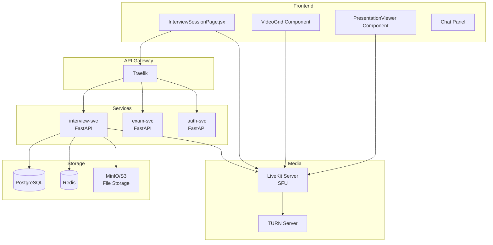
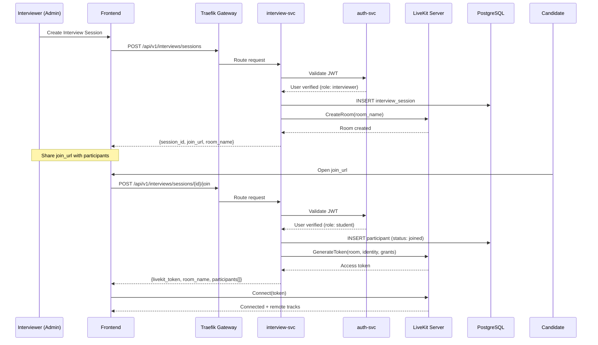
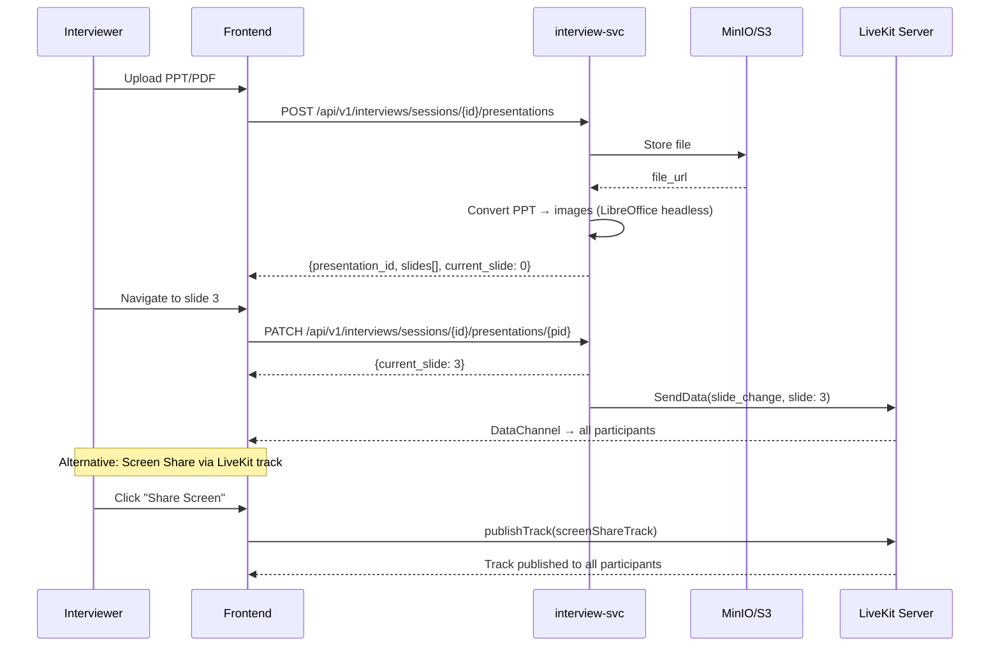

# Design Document: Interview Session

## Overview

The Interview Session feature extends proctoAi's existing session model to support multi-party video conferencing between interviewers and an interviewee, with real-time presentation/screen sharing capabilities. Unlike the existing 1:1 InterviewRoom (WebRTC/LiveKit ready), this feature enables group interviews where multiple interviewers can join a single session, see each other via video, and collaboratively evaluate a candidate while sharing presentations or screens.

The system introduces an `interview-svc` microservice responsible for session orchestration, participant management, and signaling coordination. Video transport is handled by a LiveKit media server (SFU architecture), which scales multi-party video efficiently without mesh complexity. Presentation sharing leverages LiveKit's screen-share tracks combined with a document rendering pipeline for PPT/PDF files.

## Architecture



## Sequence Diagrams

### Session Creation & Join Flow



### Presentation Sharing Flow



## Components and Interfaces

### Component 1: InterviewSessionService

**Purpose**: Core business logic for managing interview sessions, participants, and lifecycle.

**Interface**:
```python
class InterviewSessionService:
    async def create_session(
        self,
        creator_id: int,
        title: str,
        scheduled_at: datetime | None,
        max_participants: int = 6,
    ) -> InterviewSession: ...

    async def join_session(
        self,
        session_id: str,
        user_id: int,
        role: ParticipantRole,
    ) -> JoinResult: ...

    async def leave_session(
        self,
        session_id: str,
        user_id: int,
    ) -> None: ...

    async def end_session(
        self,
        session_id: str,
        ended_by: int,
    ) -> InterviewSession: ...

    async def get_session(
        self,
        session_id: str,
    ) -> InterviewSession | None: ...

    async def list_sessions(
        self,
        user_id: int,
        status: SessionStatus | None = None,
    ) -> list[InterviewSession]: ...
```

**Responsibilities**:
- Create and manage interview session lifecycle
- Enforce participant limits and role-based access
- Coordinate with LiveKit for room management
- Emit events for session state changes

### Component 2: LiveKitAdapter

**Purpose**: Abstraction layer over LiveKit Server SDK for room and token management.

**Interface**:
```python
class LiveKitAdapter:
    async def create_room(
        self,
        room_name: str,
        max_participants: int = 6,
        empty_timeout: int = 300,
    ) -> RoomInfo: ...

    async def generate_token(
        self,
        room_name: str,
        identity: str,
        name: str,
        grants: VideoGrants,
    ) -> str: ...

    async def delete_room(
        self,
        room_name: str,
    ) -> None: ...

    async def list_participants(
        self,
        room_name: str,
    ) -> list[ParticipantInfo]: ...

    async def remove_participant(
        self,
        room_name: str,
        identity: str,
    ) -> None: ...
```

**Responsibilities**:
- Manage LiveKit room lifecycle
- Generate scoped access tokens with appropriate grants
- Query room state and participant lists
- Handle LiveKit webhook events

### Component 3: PresentationService

**Purpose**: Handles file upload, conversion, and slide synchronization for shared presentations.

**Interface**:
```python
class PresentationService:
    async def upload_presentation(
        self,
        session_id: str,
        file: UploadFile,
        uploaded_by: int,
    ) -> Presentation: ...

    async def get_presentation(
        self,
        presentation_id: str,
    ) -> Presentation | None: ...

    async def set_current_slide(
        self,
        presentation_id: str,
        slide_index: int,
        changed_by: int,
    ) -> int: ...

    async def delete_presentation(
        self,
        presentation_id: str,
    ) -> None: ...
```

**Responsibilities**:
- Accept PPT/PDF uploads and store in object storage
- Convert presentations to slide images (LibreOffice headless or pdf2image)
- Track current slide position per session
- Broadcast slide changes via LiveKit data channels

## Data Models

### Model: InterviewSession

```python
class InterviewSession(Base):
    __tablename__ = "interview_sessions"

    id = Column(String(36), primary_key=True, default=lambda: str(uuid4()))
    title = Column(String(500), nullable=False)
    room_name = Column(String(100), unique=True, nullable=False)
    creator_id = Column(Integer, nullable=False)
    status = Column(String(20), default="scheduled")  # scheduled | active | ended
    max_participants = Column(Integer, default=6)
    scheduled_at = Column(DateTime, nullable=True)
    started_at = Column(DateTime, nullable=True)
    ended_at = Column(DateTime, nullable=True)
    created_at = Column(DateTime, default=func.now())
    recording_url = Column(String(1000), nullable=True)
```

**Validation Rules**:
- `title` must be non-empty, max 500 chars
- `max_participants` must be between 2 and 10
- `status` transitions: scheduled → active → ended (no backwards)
- `room_name` is auto-generated as `interview_{session_id[:8]}`

### Model: SessionParticipant

```python
class SessionParticipant(Base):
    __tablename__ = "session_participants"

    id = Column(Integer, primary_key=True, autoincrement=True)
    session_id = Column(String(36), ForeignKey("interview_sessions.id"), nullable=False)
    user_id = Column(Integer, nullable=False)
    role = Column(String(20), nullable=False)  # interviewer | interviewee | observer
    display_name = Column(String(200), nullable=False)
    joined_at = Column(DateTime, default=func.now())
    left_at = Column(DateTime, nullable=True)
    status = Column(String(20), default="connected")  # connected | disconnected | removed
```

**Validation Rules**:
- Exactly one `interviewee` per session
- Multiple `interviewer` and `observer` roles allowed
- Total participants must not exceed `session.max_participants`
- `user_id` + `session_id` combination must be unique (no duplicate joins)

### Model: Presentation

```python
class Presentation(Base):
    __tablename__ = "presentations"

    id = Column(String(36), primary_key=True, default=lambda: str(uuid4()))
    session_id = Column(String(36), ForeignKey("interview_sessions.id"), nullable=False)
    filename = Column(String(500), nullable=False)
    file_url = Column(String(1000), nullable=False)
    slide_count = Column(Integer, default=0)
    current_slide = Column(Integer, default=0)
    slides_json = Column(Text, nullable=True)  # JSON array of slide image URLs
    uploaded_by = Column(Integer, nullable=False)
    uploaded_at = Column(DateTime, default=func.now())
```

**Validation Rules**:
- `filename` must end with `.ppt`, `.pptx`, `.pdf`, or `.key`
- `current_slide` must be in range `[0, slide_count - 1]`
- Max file size: 50MB
- One active presentation per session at a time

## Algorithmic Pseudocode

### Session Join Algorithm

```python
async def join_session(session_id: str, user_id: int, role: ParticipantRole) -> JoinResult:
    """
    Handles a participant joining an interview session.
    
    Preconditions:
        - session_id refers to an existing session
        - user_id is authenticated
        - role is a valid ParticipantRole enum value
    
    Postconditions:
        - Participant record created in database
        - LiveKit token generated with appropriate grants
        - Returns JoinResult with token and session metadata
        - If session is full or invalid state, raises appropriate error
    """
    # Step 1: Fetch and validate session
    session = await db.get(InterviewSession, session_id)
    if session is None:
        raise SessionNotFoundError(session_id)
    
    if session.status == "ended":
        raise SessionEndedError(session_id)
    
    # Step 2: Check participant limits
    current_count = await db.count_participants(session_id, status="connected")
    if current_count >= session.max_participants:
        raise SessionFullError(session_id, session.max_participants)
    
    # Step 3: Enforce role constraints
    if role == ParticipantRole.INTERVIEWEE:
        existing_interviewee = await db.find_participant(
            session_id, role=ParticipantRole.INTERVIEWEE
        )
        if existing_interviewee is not None:
            raise DuplicateIntervieweeError(session_id)
    
    # Step 4: Check for rejoin (user previously left)
    existing = await db.find_participant(session_id, user_id=user_id)
    if existing and existing.status == "disconnected":
        existing.status = "connected"
        existing.joined_at = datetime.utcnow()
        existing.left_at = None
        await db.commit()
        participant = existing
    else:
        # Step 5: Create new participant record
        participant = SessionParticipant(
            session_id=session_id,
            user_id=user_id,
            role=role.value,
            display_name=await get_display_name(user_id),
            status="connected",
        )
        await db.add(participant)
        await db.commit()
    
    # Step 6: Activate session if first join
    if session.status == "scheduled":
        session.status = "active"
        session.started_at = datetime.utcnow()
        await db.commit()
    
    # Step 7: Generate LiveKit token with role-based grants
    grants = VideoGrants(
        room_join=True,
        room=session.room_name,
        can_publish=role != ParticipantRole.OBSERVER,
        can_subscribe=True,
        can_publish_data=role != ParticipantRole.OBSERVER,
    )
    
    token = await livekit.generate_token(
        room_name=session.room_name,
        identity=str(user_id),
        name=participant.display_name,
        grants=grants,
    )
    
    # Step 8: Return join result
    return JoinResult(
        livekit_token=token,
        room_name=session.room_name,
        session=session,
        participants=await db.list_participants(session_id),
    )
```

**Loop Invariants**: N/A (no loops in this algorithm)

### Presentation Upload & Conversion Algorithm

```python
async def upload_presentation(
    session_id: str, file: UploadFile, uploaded_by: int
) -> Presentation:
    """
    Handles presentation upload, storage, and conversion to slide images.
    
    Preconditions:
        - session_id refers to an active session
        - file is a valid PPT/PPTX/PDF file under 50MB
        - uploaded_by is a participant with interviewer role
    
    Postconditions:
        - File stored in object storage
        - Slides converted to individual images
        - Presentation record created with slide URLs
        - Previous active presentation deactivated
    """
    # Step 1: Validate session and permissions
    session = await db.get(InterviewSession, session_id)
    if session is None or session.status != "active":
        raise InvalidSessionError(session_id)
    
    participant = await db.find_participant(session_id, user_id=uploaded_by)
    if participant is None or participant.role not in ("interviewer", "interviewee"):
        raise PermissionDeniedError("Only interviewers/interviewees can share presentations")
    
    # Step 2: Validate file
    if file.size > 50 * 1024 * 1024:  # 50MB limit
        raise FileTooLargeError(file.size, max_size=50 * 1024 * 1024)
    
    allowed_extensions = {".ppt", ".pptx", ".pdf", ".key"}
    ext = Path(file.filename).suffix.lower()
    if ext not in allowed_extensions:
        raise InvalidFileTypeError(ext, allowed_extensions)
    
    # Step 3: Store original file
    storage_path = f"interviews/{session_id}/presentations/{uuid4()}{ext}"
    file_url = await storage.upload(storage_path, file)
    
    # Step 4: Convert to slide images
    slides = await convert_to_slides(file_url, ext)
    # convert_to_slides uses LibreOffice headless for PPT/PPTX
    # and pdf2image for PDF files
    
    slide_urls = []
    for i, slide_image in enumerate(slides):
        slide_path = f"interviews/{session_id}/slides/{uuid4()}_{i}.png"
        url = await storage.upload(slide_path, slide_image)
        slide_urls.append(url)
    
    # Step 5: Deactivate previous presentation (if any)
    await db.deactivate_presentations(session_id)
    
    # Step 6: Create presentation record
    presentation = Presentation(
        session_id=session_id,
        filename=file.filename,
        file_url=file_url,
        slide_count=len(slide_urls),
        current_slide=0,
        slides_json=json.dumps(slide_urls),
        uploaded_by=uploaded_by,
    )
    await db.add(presentation)
    await db.commit()
    
    # Step 7: Notify all participants via data channel
    await livekit.send_data(
        room_name=session.room_name,
        data=json.dumps({
            "type": "presentation_loaded",
            "presentation_id": presentation.id,
            "slide_count": len(slide_urls),
            "current_slide": 0,
        }),
    )
    
    return presentation
```

**Loop Invariants**:
- For slide conversion loop: All previously uploaded slides have valid URLs in `slide_urls`
- `len(slide_urls) == i` at the start of each iteration

## Key Functions with Formal Specifications

### Function: create_session()

```python
async def create_session(
    creator_id: int,
    title: str,
    scheduled_at: datetime | None,
    max_participants: int = 6,
) -> InterviewSession:
```

**Preconditions:**
- `creator_id` refers to an authenticated user with interviewer/admin role
- `title` is non-empty string with length ≤ 500
- `max_participants` is in range [2, 10]
- `scheduled_at` is None (immediate) or a future datetime

**Postconditions:**
- Returns a new `InterviewSession` with status "scheduled"
- A LiveKit room is created with matching `room_name`
- Session is persisted in the database
- `room_name` is unique and follows pattern `interview_{id[:8]}`

**Loop Invariants:** N/A

### Function: generate_participant_token()

```python
async def generate_participant_token(
    session: InterviewSession,
    user_id: int,
    role: ParticipantRole,
) -> str:
```

**Preconditions:**
- `session` is an active or scheduled InterviewSession
- `user_id` is a valid authenticated user
- `role` is one of: interviewer, interviewee, observer

**Postconditions:**
- Returns a valid LiveKit JWT access token
- Token grants: `can_publish = (role != observer)`
- Token grants: `can_subscribe = True` for all roles
- Token grants: `can_publish_data = (role != observer)`
- Token identity matches `str(user_id)`
- Token expires after session's expected duration + 30 min buffer

**Loop Invariants:** N/A

### Function: set_current_slide()

```python
async def set_current_slide(
    presentation_id: str,
    slide_index: int,
    changed_by: int,
) -> int:
```

**Preconditions:**
- `presentation_id` refers to an existing active presentation
- `slide_index` is in range [0, presentation.slide_count - 1]
- `changed_by` is a participant with interviewer or interviewee role

**Postconditions:**
- `presentation.current_slide` is updated to `slide_index`
- All connected participants receive a `slide_change` data message
- Returns the new `current_slide` value
- No change if `slide_index == presentation.current_slide`

**Loop Invariants:** N/A

## Example Usage

```python
# Example 1: Create an interview session
from interview_svc.services import InterviewSessionService

service = InterviewSessionService(db=db, livekit=livekit_adapter)

session = await service.create_session(
    creator_id=42,
    title="Senior Backend Engineer - Round 2",
    scheduled_at=datetime(2025, 7, 15, 14, 0),
    max_participants=4,
)
# session.id = "a1b2c3d4-..."
# session.room_name = "interview_a1b2c3d4"
# session.status = "scheduled"


# Example 2: Candidate joins the session
join_result = await service.join_session(
    session_id=session.id,
    user_id=101,
    role=ParticipantRole.INTERVIEWEE,
)
# join_result.livekit_token = "eyJ..."
# join_result.room_name = "interview_a1b2c3d4"
# join_result.participants = [...]


# Example 3: Frontend connects to LiveKit
# (React/TypeScript)
import { LiveKitRoom, VideoConference } from "@livekit/components-react"

function InterviewSessionPage({ token, roomName }) {
    return (
        <LiveKitRoom token={token} serverUrl={LIVEKIT_URL} connect={True}>
            <VideoConference />
            <PresentationViewer />
            <ChatPanel />
        </LiveKitRoom>
    )
}


# Example 4: Upload and share a presentation
presentation = await presentation_service.upload_presentation(
    session_id=session.id,
    file=uploaded_file,  # UploadFile from FastAPI
    uploaded_by=42,
)
# presentation.slide_count = 15
# presentation.current_slide = 0

# Navigate to slide 5
await presentation_service.set_current_slide(
    presentation_id=presentation.id,
    slide_index=5,
    changed_by=42,
)
```

## Correctness Properties

*A property is a characteristic or behavior that should hold true across all valid executions of a system — essentially, a formal statement about what the system should do. Properties serve as the bridge between human-readable specifications and machine-verifiable correctness guarantees.*

### Property 1: Participant Limit Invariant

*For any* active interview session with a defined max_participants value, and *for any* sequence of join and leave operations performed on that session, the count of participants with status "connected" shall never exceed max_participants.

**Validates: Requirements 2.2, 5.3**

### Property 2: Single Interviewee Constraint

*For any* interview session and *for any* sequence of join operations, the count of participants with role "interviewee" and status "connected" shall never exceed 1.

**Validates: Requirement 2.3**

### Property 3: Status Monotonicity

*For any* interview session and *for any* sequence of state transition attempts, the session status shall only progress forward through the ordered sequence (scheduled → active → ended). No backward transition shall ever succeed.

**Validates: Requirements 2.5, 2.6, 4.1, 4.3**

### Property 4: Token Grant Determinism

*For any* participant role and session, the generated LiveKit token shall have deterministic grants: interviewers and interviewees receive (can_publish=true, can_subscribe=true, can_publish_data=true), observers receive (can_publish=false, can_subscribe=true, can_publish_data=false). The token identity shall equal str(user_id) and the token room shall equal the session's room_name.

**Validates: Requirements 3.1, 3.2, 3.3, 3.4, 3.5**

### Property 5: Slide Index Bounds

*For any* active presentation with a defined slide_count, and *for any* sequence of set_current_slide operations (including out-of-bounds attempts that are rejected), the current_slide value shall always satisfy 0 <= current_slide < slide_count.

**Validates: Requirements 7.2, 7.3**

### Property 6: Rejoin Idempotency

*For any* user who has previously joined and then left a session (status "disconnected"), rejoining the same session shall reactivate the existing participant record. The total count of participant records for that user_id and session_id combination shall always be exactly 1.

**Validates: Requirements 2.4, 5.4**

### Property 7: Session Creation Validation

*For any* session creation request where the title is empty or exceeds 500 characters, or where max_participants is outside the range [2, 10], the Session_Service shall reject the request. Conversely, *for any* request with a valid title (1-500 chars) and valid max_participants (2-10), creation shall succeed.

**Validates: Requirements 1.3, 1.4**

### Property 8: File Upload Validation

*For any* uploaded file where the size exceeds 50MB, or the file extension is not in {.ppt, .pptx, .pdf, .key}, or the MIME type does not match the declared extension, the Presentation_Service shall reject the upload. Valid files (correct extension, matching MIME type, size ≤ 50MB) shall be accepted.

**Validates: Requirements 6.2, 6.3, 10.3**

### Property 9: Single Active Presentation

*For any* session, after any upload_presentation operation completes, there shall be exactly one active presentation associated with that session. All previously active presentations shall be deactivated.

**Validates: Requirement 6.4**

### Property 10: Room Name Convention

*For any* created interview session, the room_name shall follow the pattern `interview_{session_id[:8]}`, and this room_name shall be unique across all sessions.

**Validates: Requirement 1.2**

## Error Handling

### Error Scenario 1: LiveKit Server Unavailable

**Condition**: LiveKit server is unreachable during room creation or token generation
**Response**: Return HTTP 503 with `{"error": "media_server_unavailable", "retry_after": 5}`
**Recovery**: Client retries with exponential backoff. Session remains in "scheduled" state until LiveKit is available.

### Error Scenario 2: Presentation Conversion Failure

**Condition**: LibreOffice headless fails to convert PPT/PPTX to images
**Response**: Return HTTP 422 with `{"error": "conversion_failed", "detail": "..."}`
**Recovery**: Original file is retained in storage. User can retry upload or share screen directly via LiveKit screen-share track.

### Error Scenario 3: Participant Disconnection

**Condition**: WebRTC connection drops (network issue)
**Response**: LiveKit fires `participant_disconnected` webhook → interview-svc updates participant status to "disconnected"
**Recovery**: Participant can rejoin within session lifetime. Their video tile shows "reconnecting..." state in UI.

### Error Scenario 4: Session Creator Leaves

**Condition**: The interviewer who created the session disconnects
**Response**: Session continues — other interviewers can still manage. If all interviewers leave, session auto-ends after `empty_timeout` (5 min).
**Recovery**: Creator can rejoin. Auto-end is cancelled if any interviewer rejoins within timeout.

### Error Scenario 5: Concurrent Slide Navigation

**Condition**: Two interviewers try to change slides simultaneously
**Response**: Last-write-wins with optimistic concurrency. Both changes are applied in order received.
**Recovery**: All participants receive the final slide position via data channel broadcast. UI shows the authoritative slide index.

## Testing Strategy

### Unit Testing Approach

- Test `InterviewSessionService` methods with mocked DB and LiveKit adapter
- Test role-based grant generation for all participant roles
- Test session status transitions (valid and invalid)
- Test participant limit enforcement
- Test presentation file validation (size, type, extension)
- Coverage goal: 90%+ for service layer

### Property-Based Testing Approach

**Property Test Library**: Hypothesis (Python)

- **Property**: For any sequence of join/leave operations, participant count never exceeds `max_participants`
- **Property**: For any sequence of `set_current_slide` calls with valid indices, `current_slide` is always in bounds
- **Property**: For any combination of roles assigned to participants, at most one interviewee exists
- **Property**: Token grants are deterministic — same (role, session) always produces same grant set

### Integration Testing Approach

- Test full session lifecycle: create → join (multiple participants) → share presentation → navigate slides → end
- Test LiveKit webhook handling for participant events
- Test file upload → conversion → slide serving pipeline
- Test gateway routing for `/api/v1/interviews/*` endpoints
- Test WebSocket/data channel message delivery for slide sync

## Performance Considerations

- **LiveKit SFU**: Selective Forwarding Unit architecture means server CPU scales linearly with participants, not quadratically like mesh WebRTC. Supports up to 10 participants per room comfortably.
- **Presentation Conversion**: PPT→image conversion is CPU-intensive. Offload to Celery worker to avoid blocking the API. Cache converted slides in S3/MinIO.
- **Slide Sync Latency**: Use LiveKit data channels (WebRTC DataChannel) for sub-100ms slide change propagation. Avoid HTTP polling.
- **Connection Pooling**: Reuse LiveKit API client connections. Use connection pool for PostgreSQL (already configured with pool_size=10).
- **File Size Limits**: 50MB max upload prevents memory exhaustion. Stream uploads directly to object storage.

## Security Considerations

- **Token Scoping**: LiveKit tokens are scoped to specific rooms with minimal grants. Observers cannot publish audio/video/data.
- **Session Access Control**: Only invited participants (or users with valid join links) can join. JWT validation on every API call.
- **File Upload Validation**: Validate MIME type (not just extension), scan for malicious content, enforce size limits.
- **Room Isolation**: Each session gets a unique LiveKit room. No cross-session media leakage.
- **Recording Consent**: If recording is enabled, all participants must be notified. Recording URL stored securely with access control.
- **TURN Server**: TURN relay ensures connectivity through restrictive firewalls without exposing internal IPs.

## Dependencies

| Dependency | Purpose | Version |
|---|---|---|
| livekit-server-sdk (Python) | LiveKit room/token management | ^0.6 |
| @livekit/components-react | React video UI components | ^2.0 |
| livekit-client (JS) | Browser WebRTC client | ^2.0 |
| python-multipart | File upload handling | ^0.0.6 |
| pdf2image | PDF to slide image conversion | ^1.16 |
| python-pptx | PPT metadata extraction | ^0.6 |
| LibreOffice (headless) | PPT/PPTX → PDF conversion | System package |
| MinIO/S3 | Object storage for files/slides | Infrastructure |
| LiveKit Server | SFU media server | ^1.5 |
| Coturn | TURN/STUN relay server | Infrastructure |
