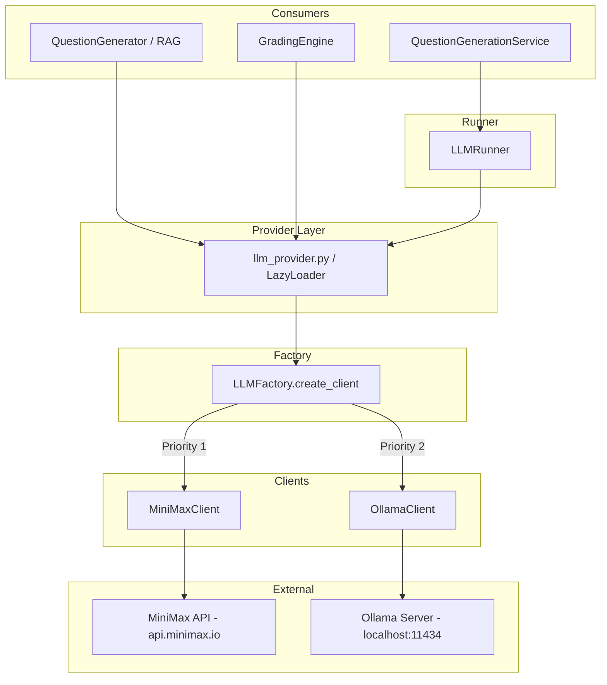
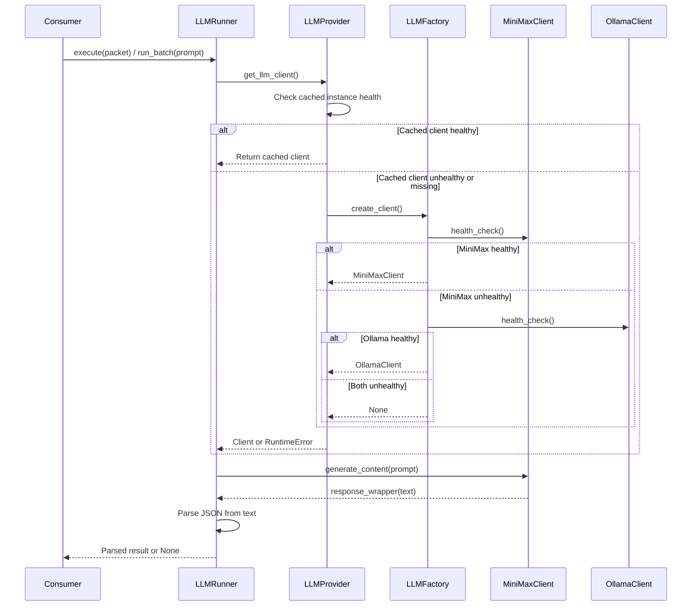

# Design Document: MiniMax LLM Integration

## Overview

This design introduces MiniMax 2.5 as the primary LLM provider for the ProctoAI platform, replacing the current Ollama-first/Gemini-fallback chain with a MiniMax-first/Ollama-fallback chain. The integration touches four key layers:

1. **Client Layer** — A new `MiniMaxClient` class implementing the `LLMClient` abstract interface
2. **Factory Layer** — Reordered `LLMFactory` with MiniMax as priority 1, Ollama as priority 2, Gemini removed
3. **Runner Layer** — `LLMRunner` migrated from direct Ollama HTTP calls to the `LLMFactory` abstraction
4. **Provider Layer** — Enhanced `llm_provider.py` with re-attempt logic for primary provider recovery

All downstream consumers (QuestionGenerationService, QuestionGenerator/RAG, GradingEngine) continue to use the same `LLMClient` interface and require no code changes.

### Key Design Decisions

| Decision | Rationale |
|----------|-----------|
| OpenAI-compatible endpoint (`/v1/chat/completions`) | MiniMax exposes an OpenAI-compatible API, simplifying integration and future provider swaps |
| Response wrapper pattern preserved | Existing consumers expect `response.text`; the wrapper maintains backward compatibility |
| `response_format: {"type": "json_object"}` not used by default | MiniMax supports it, but not all prompts expect JSON. The LLMRunner already handles JSON parsing. The client returns raw text. |
| Health check = key presence + live HTTP probe | Matches the existing Ollama pattern (tags endpoint) and catches both config and connectivity issues |
| LLMRunner delegates to provider singleton | Eliminates duplicated HTTP logic and ensures all paths benefit from fallback |

## Architecture



### Request Flow



## Components and Interfaces

### 1. MiniMaxClient (new)

**File:** `backend/utils/llm_client.py`

```python
class MiniMaxClient(LLMClient):
    """Client for MiniMax 2.5 API (OpenAI-compatible endpoint)"""

    API_URL = "https://api.minimax.io/v1/chat/completions"
    DEFAULT_MODEL = "MiniMax-M1"
    REQUEST_TIMEOUT = 60  # seconds
    HEALTH_CHECK_TIMEOUT = 5  # seconds

    def __init__(self, api_key: str, model: str = None):
        self.api_key = api_key
        self.model = model or os.getenv("MINIMAX_MODEL", self.DEFAULT_MODEL)

    def health_check(self) -> bool:
        """Return True if API key is set and a test request succeeds within 5s."""
        ...

    def generate_content(self, prompt: str, **kwargs) -> Optional[ResponseWrapper]:
        """Send prompt to MiniMax chat completions and return response wrapper."""
        ...
```

**Interface contract:**
- `generate_content(prompt: str) -> Optional[response_wrapper]` where `response_wrapper.text` is the raw string content from the assistant message
- `health_check() -> bool`
- Returns `None` on any failure (timeout, HTTP error, missing key)

### 2. LLMFactory (modified)

**File:** `backend/utils/llm_client.py`

Changes:
- Priority 1: `MiniMaxClient` (health check with 5s timeout)
- Priority 2: `OllamaClient` (health check with 5s timeout)
- Gemini removed entirely
- Each provider wrapped in try/except to handle unexpected exceptions

```python
class LLMFactory:
    @staticmethod
    def create_client() -> Optional[LLMClient]:
        # Priority 1: MiniMax
        api_key = os.getenv("MINIMAX_API_KEY", "")
        if api_key:
            client = MiniMaxClient(api_key)
            try:
                if client.health_check():
                    logger.info("Using MiniMax as primary LLM")
                    return client
            except Exception as e:
                logger.warning(f"MiniMax health check exception: {e}")

        # Priority 2: Ollama (fallback)
        ollama_url = os.getenv("OLLAMA_BASE_URL", "http://localhost:11434")
        ollama_model = os.getenv("OLLAMA_MODEL", "llama3.1:8b")
        client = OllamaClient(ollama_url, ollama_model)
        try:
            if client.health_check():
                logger.info("Using Ollama as fallback LLM")
                return client
        except Exception as e:
            logger.warning(f"Ollama health check exception: {e}")

        logger.error("No LLM client available (MiniMax and Ollama both unavailable).")
        return None
```

### 3. LLMRunner (modified)

**File:** `backend/llm_runner.py`

Changes:
- Remove direct `requests.post` to Ollama
- Obtain client via `get_llm_client()` from `llm_provider`
- Pass constructed prompt string to `client.generate_content(prompt)`
- Preserve: prompt truncation (8000 chars), JSON parsing, regex fallback, timeout semantics
- Handle `RuntimeError` from provider when no client available
- Pass skill-specific parameters (temperature, max_tokens) via `**kwargs` to `generate_content`

```python
class LLMRunner:
    @staticmethod
    def run_batch(blueprint_prompt, batch_config, skill_metadata=None):
        from backend.providers.llm_provider import get_llm_client

        # ... extract params (temperature, max_tokens) same as before ...
        # ... construct full_prompt, truncate to 8000 chars ...

        try:
            client = get_llm_client()
        except RuntimeError as e:
            logger.error(f"LLMRunner: No LLM available for batch {batch_config['batch_id']}: {e}")
            return None

        try:
            response = client.generate_content(
                full_prompt,
                temperature=temperature,
                max_tokens=max_tokens
            )
            if response is None:
                logger.error(f"LLMRunner: generate_content returned None for batch {batch_config['batch_id']}")
                return None

            raw_text = response.text
            return json.loads(raw_text)
        except json.JSONDecodeError:
            logger.error(f"LLMRunner: Failed to parse JSON for batch {batch_config['batch_id']}")
            return None
        except Exception as e:
            logger.error(f"LLMRunner: Critical Error for batch {batch_config['batch_id']}: {e}")
            return None
```

### 4. LLM Provider (modified)

**File:** `backend/providers/llm_provider.py`

Changes:
- On health check failure, reset and re-create via factory (existing behavior preserved)
- The factory itself now tries MiniMax first, enabling automatic recovery to primary

The existing `get_llm_client()` logic already resets on health failure and calls `LLMFactory.create_client()` again, which naturally re-attempts MiniMax first. No structural change needed beyond ensuring the factory order is correct.

### 5. Config (modified)

**File:** `backend/config.py`

```python
class Config:
    # ... existing fields ...

    # MiniMax LLM
    MINIMAX_API_KEY = os.getenv("MINIMAX_API_KEY", "")
    MINIMAX_MODEL = os.getenv("MINIMAX_MODEL", "MiniMax-M1")
```

### 6. GeminiClient (removed from factory chain)

The `GeminiClient` class remains in the codebase for potential future use but is no longer instantiated by `LLMFactory.create_client()`.

## Data Models

### Response Wrapper

All LLM clients return a consistent wrapper object:

```python
class ResponseWrapper:
    """Standardized response from any LLM client."""
    def __init__(self, text: str):
        self.text = text  # Raw string content from the LLM
```

### MiniMax API Request Body

```json
{
  "model": "MiniMax-M1",
  "messages": [
    {
      "role": "user",
      "content": "<prompt string>"
    }
  ],
  "temperature": 0.7,
  "max_completion_tokens": 2048
}
```

### MiniMax API Response Body (relevant fields)

```json
{
  "id": "...",
  "choices": [
    {
      "finish_reason": "stop",
      "index": 0,
      "message": {
        "content": "<generated text>",
        "role": "assistant"
      }
    }
  ],
  "usage": {
    "total_tokens": 120,
    "prompt_tokens": 42,
    "completion_tokens": 78
  },
  "base_resp": {
    "status_code": 0,
    "status_msg": ""
  }
}
```

### Environment Variables

| Variable | Default | Description |
|----------|---------|-------------|
| `MINIMAX_API_KEY` | `""` (empty) | MiniMax API bearer token |
| `MINIMAX_MODEL` | `MiniMax-M1` | Model identifier for chat completions |
| `OLLAMA_BASE_URL` | `http://localhost:11434` | Ollama server URL (fallback) |
| `OLLAMA_MODEL` | `llama3.1:8b` | Ollama model name (fallback) |


## Correctness Properties

*A property is a characteristic or behavior that should hold true across all valid executions of a system — essentially, a formal statement about what the system should do. Properties serve as the bridge between human-readable specifications and machine-verifiable correctness guarantees.*

### Property 1: Response Parsing Round-Trip

*For any* valid MiniMax API response containing a `choices[0].message.content` string, the `MiniMaxClient.generate_content()` method SHALL return a response wrapper whose `.text` attribute equals that content string exactly.

**Validates: Requirements 1.2, 8.3**

### Property 2: Request Construction Correctness

*For any* non-empty prompt string passed to `MiniMaxClient.generate_content()`, the outgoing HTTP request SHALL contain a JSON body with `model` set to the configured model name, a `messages` array with exactly one object having `role` equal to `"user"` and `content` equal to the prompt string, a `Content-Type: application/json` header, and an `Authorization: Bearer <key>` header with the configured API key.

**Validates: Requirements 8.1, 8.2, 8.5, 4.4**

### Property 3: Factory Priority Ordering

*For any* combination of provider health states (MiniMax healthy/unhealthy/exception, Ollama healthy/unhealthy/exception), `LLMFactory.create_client()` SHALL return the highest-priority healthy provider (MiniMax > Ollama) or `None` if all providers are unavailable, and SHALL never raise an unhandled exception.

**Validates: Requirements 2.1, 2.6**

### Property 4: Error Responses Yield None

*For any* HTTP error status code (400–599) returned by the MiniMax API, or *for any* response body that does not contain the expected `choices[0].message.content` structure, `MiniMaxClient.generate_content()` SHALL return `None`.

**Validates: Requirements 1.4, 8.4**

### Property 5: Prompt Truncation Invariant

*For any* prompt string passed to `LLMRunner.run_batch()`, if the prompt length exceeds 8000 characters, the prompt passed to `generate_content()` SHALL have length ≤ 8000 + length of the truncation suffix, and if the prompt length is ≤ 8000 characters, it SHALL be passed unchanged.

**Validates: Requirements 3.3**

### Property 6: Parameter Forwarding

*For any* valid temperature value (0 < t ≤ 1) and max_tokens value (≥ 1) provided in skill_metadata, `LLMRunner.run_batch()` and `LLMRunner.execute()` SHALL pass those exact values to the active LLM client's `generate_content()` method.

**Validates: Requirements 3.5**

## Error Handling

### MiniMaxClient Errors

| Scenario | Behavior |
|----------|----------|
| `MINIMAX_API_KEY` empty/unset | `health_check()` returns `False`; `generate_content()` logs error and returns `None` without sending request |
| HTTP 4xx/5xx response | Log error with status code, return `None` |
| Request timeout (>60s) | Log timeout warning, return `None` |
| Network error (DNS, connection refused) | Log error, return `None` |
| Malformed response body (missing `choices`) | Log unexpected format error, return `None` |
| `base_resp.status_code != 0` in response | Log API-level error, return `None` |

### LLMFactory Errors

| Scenario | Behavior |
|----------|----------|
| MiniMax health check raises exception | Log warning, proceed to Ollama |
| Ollama health check raises exception | Log warning, return `None` |
| Both providers unavailable | Log error, return `None` |

### LLMRunner Errors

| Scenario | Behavior |
|----------|----------|
| `get_llm_client()` raises `RuntimeError` | Catch, log error, return `None` |
| `generate_content()` returns `None` | Log failure with batch/skill ID, return `None` |
| Response text is not valid JSON | Log parse error, attempt regex extraction, return `None` if both fail |
| Unexpected exception during execution | Catch, log, return `None` |

### LLM Provider Errors

| Scenario | Behavior |
|----------|----------|
| Cached client health check fails | Reset via `LazyLoader.reset("llm")`, re-create via factory |
| Health check raises exception | Reset, re-create via factory |
| Factory returns `None` after reset | Raise `RuntimeError("No LLM client could be initialized")` |

### Downstream Consumer Errors

| Consumer | Scenario | Behavior |
|----------|----------|----------|
| QuestionGenerationService | `LLMRunner.execute()` returns `None` | Log warning, skip that question type, continue with others |
| QuestionGenerator (RAG) | `self.llm_client` is `None` | Call `_generate_fallback_questions()` with template-based MCQs |
| QuestionGenerator (RAG) | `generate_content()` returns `None` | Call `_generate_fallback_questions()` with template-based MCQs |

## Testing Strategy

### Unit Tests (Example-Based)

| Test | Validates |
|------|-----------|
| MiniMaxClient health check with valid key + 200 response → True | Req 1.3 |
| MiniMaxClient health check with empty key → False | Req 1.6 |
| MiniMaxClient health check with timeout → False | Req 1.3 |
| MiniMaxClient generate_content with empty API key → None (no request sent) | Req 4.5 |
| LLMFactory returns MiniMaxClient when MiniMax healthy | Req 2.2 |
| LLMFactory returns OllamaClient when MiniMax unhealthy | Req 2.3 |
| LLMFactory returns None when both unhealthy | Req 2.4 |
| LLMRunner returns None when get_llm_client raises RuntimeError | Req 3.6 |
| LLMRunner returns None when generate_content returns None | Req 3.4 |
| QuestionGenerator falls back to template questions when llm_client is None | Req 7.3 |
| QuestionGenerator falls back when generate_content returns None | Req 7.4 |
| Config.MINIMAX_API_KEY defaults to empty string | Req 4.1 |
| Config.MINIMAX_MODEL defaults to "MiniMax-M1" | Req 4.2 |

### Property-Based Tests

**Library:** [Hypothesis](https://hypothesis.readthedocs.io/) (Python PBT framework)

**Configuration:** Minimum 100 iterations per property test.

| Property Test | Tag |
|---------------|-----|
| Response parsing round-trip | Feature: minimax-llm-integration, Property 1: Response parsing round-trip |
| Request construction correctness | Feature: minimax-llm-integration, Property 2: Request construction correctness |
| Factory priority ordering | Feature: minimax-llm-integration, Property 3: Factory priority ordering |
| Error responses yield None | Feature: minimax-llm-integration, Property 4: Error responses yield None |
| Prompt truncation invariant | Feature: minimax-llm-integration, Property 5: Prompt truncation invariant |
| Parameter forwarding | Feature: minimax-llm-integration, Property 6: Parameter forwarding |

### Integration Tests

| Test | Validates |
|------|-----------|
| LLM Provider health-check-and-reset cycle with mocked providers | Req 5.1, 5.2, 5.5 |
| LLM Provider raises RuntimeError when both providers fail | Req 5.4 |
| QuestionGenerationService end-to-end with mocked MiniMax responses | Req 6.1, 6.3 |
| QuestionGenerator RAG path with mocked LLM client | Req 7.1, 7.2 |
| PDF scan mode produces results without LLM involvement | Req 6.5 |

### Smoke Tests

| Test | Validates |
|------|-----------|
| MiniMaxClient is a subclass of LLMClient | Req 1.1 |
| LLMFactory does not instantiate GeminiClient | Req 2.5 |
| .env.example contains MINIMAX_API_KEY and MINIMAX_MODEL | Req 4.3 |
| QuestionGenerationService has no hardcoded provider references | Req 6.2 |
